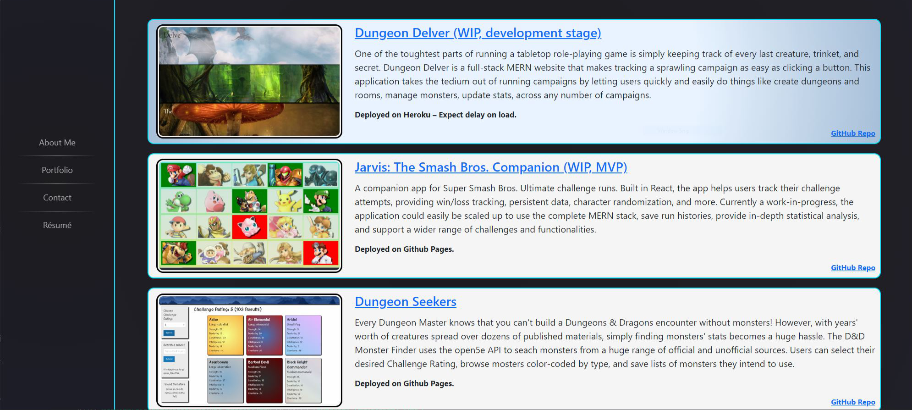

# Portfolio — Ben Martin

Welcome to my React-based portfolio! Here you'll see a sampling of my work, along with a brief biography, contact information, and a downloadable resume.

## Description
This is a component-oriented design, rendering objects as needed on the fly. The single-page design allows for immediate load times and provides a slick user experience.

[GitHub Repository](https://github.com/the-wake/a20-react-portfolio)

## Installation
No installation is needed. The application front-end is run through GitHub Pages using React's GH Pages deployment.

## Functionality
Users can use the navigation bar to navigate between a bio, portfolio, and contact form, or to render my résumé as an HTML object. The portfolio contains a number of projects that are rendered using react and OOP. These all contain links to live applications (where relevant) and the GitHub repos.

The page is heavily reactive, displaying well for displays down to 400px in width. The navbar uses the _sticky_ property to affix to the top of the screen once the user scrolls past it, so that they can easily jump from page to page. In addition, the banner image automatically adjusts itself to 90% of user viewport height, to provide a beautiful landing image without obstructing navigation.

## Tools Used
* JavaScript
* Node
* NPM
* React
* GitHub
* GitBash
* Coded in VS Code
